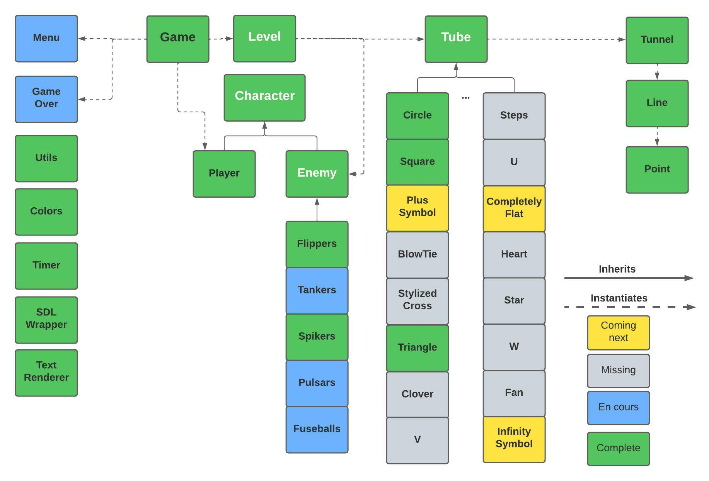

# 
 Remake de TEMPEST ATARI 1981 en C++ Moderne

## 
 UE Programmation Avancée - Rapport Individuel 

### 
 **JANATI Siham** <<siham.janati@etu.unistra.fr>> 

#### 
 Binôme: FOERSTER Stephen <<stephen.foerster@etu.unistra.fr>> 

#

  

## **Introduction**

Le sujet de ce projet est la réalisation d'un remake du jeu d'arcade Tempest Atari (version 1981) avec la libraire SDL, le but principal étant la prise en main du C++ moderne et plus généralement de la programmation orientée objet.
Ce rapport présente le modèle de développement, la spécification, nos choix d'implémentations, les difficultés rencontrées et finalement nos perspectives.

  

## **Modèle de développment**

Nous avons opté pour un modèle de developpement agile pour ce projet. Nous avons commencé par étudier les fonctionnalités du jeu et définir une spécification complète sans nous fixer une limite vis à vis de nos objectifs. Cela nous a permis d'avoir une vision loitaine dès le départ, notre code pouvait donc à toute étape du projet être facilement incrémenté pour intégrer plus de fonctionnalités.

  

## **Spécification**

 

### **Diagramme UML**
 

 

### **Choix d'implémentation**

 

Afin de pouvoir respecter les prérequis de notre processus incrémentale, nous avons créer des entités séparées pour chaque fonctionnalité. Ainsi, la classe ***Game*** qui s'occupe de mettre à jour l'état du jeu et du rendu est séparée de la classe ***Level*** qui elle contient toutes les informations nécessaires qui caractèrisent chaque niveau en particuler et qui se met à jour au signal de la classe ***Game*** pour passer au niveau suivant, construire la nouvelle carte et mettre à jour le types des ennemis ainsi que leurs couleurs.  

La classe ***Level*** contient une instantation complète de toutes les fonctionnalités du jeu.
Pour les intégrer, il suffirait de créer les classes manquantes, et décommentez une ligne du code dans ***Level***. Par exemple pour ajouter une nouvelle carte, il n'y a pas de modifications à apporter à d'autres classes, il suffit de créer la classe pour cette carte, et décommentez une ligne dans ***Level***. Elle fera ainsi partie du jeu. Similairement pour les ennemis. 

La gestion du temps est gérée par la classe ***Timer***, qui est une ensapsulation de SDL et qui permet d'instancier une horloge, de la mettre à jour, de la mettre en pause ou de récupérer sa valeur. La classe contient un vecteur d'horloges. Pour l'utiliser dans ***Game***, un ***enum*** défini dans le fichier ***Utils.hpp*** permet de récupérer l'index de l'horloge qui nous intéresse.  

L'affichage du texte est gérée par la classe ***TextRenderer*** avec les fontes de Hershey, cette classe permet aussi de créer d'autres rendus comme les points de vie qui sont représentées par des images d'un vaisseau, comme dans le jeu original. 

Le ***SDLWrapper*** est une encapsulation de la libraire SDL. Pour pouvoir utiliser les fonctionnalités du C++ moderne, les smart pointers notamment, il nous a fallu définir une encapsulation des pointeurs classiques des objets de la SDL. Pour cela, nous avons créer une fonction Template qui prends en paramètre un pointeur classique, et retourne un smart pointer. Au sein de cette fonction, une fonction lambda, utilisée comme paramètre à l'instantation du smart pointers, permet de définir une fonction de libération du pointeur classique qui est requis par les smart pointers. 
Ce fichier peut être utilisé par toutes les classes et contient aussi une encapsulation des méthodes d'initialisation de la libraire, de rendu d'images, de changement de couleur. Nous avons trouvé plus élégant de ne pas y intégrer la classe ***Timer*** qui elle joue uniquement le rôle d'un chronomètre.
 

  

## **Répartition des tâches** 

  

## **Difficultés rencontrées**

  

## **Perspectives**
