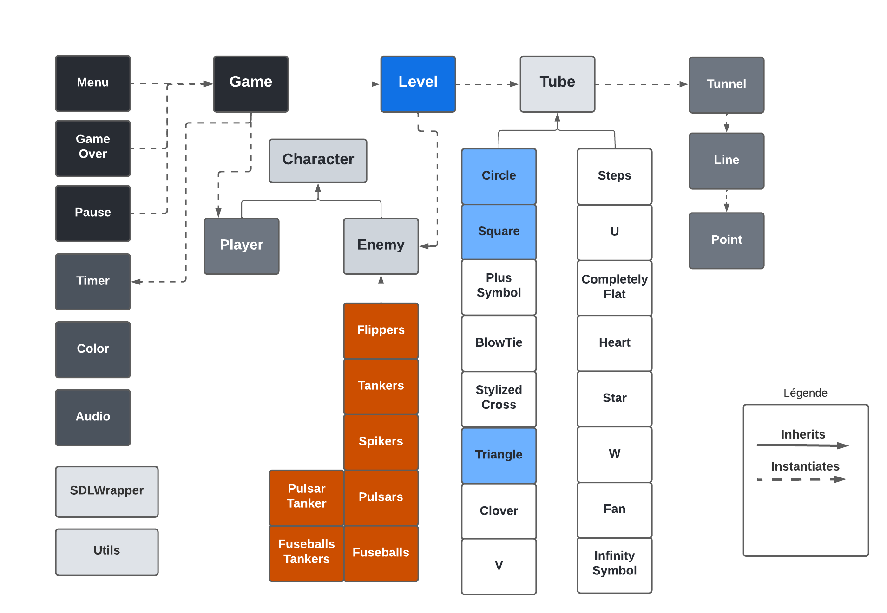
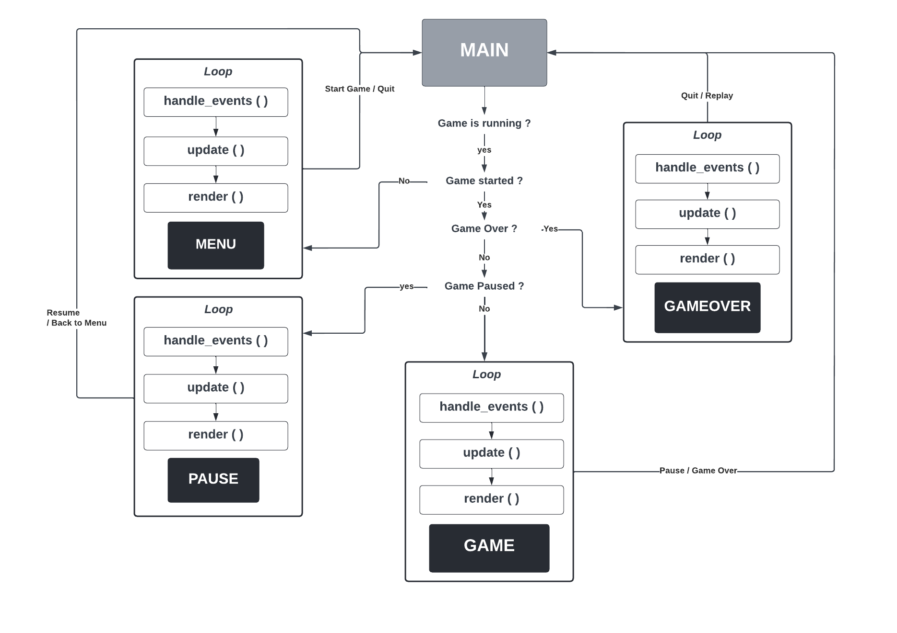
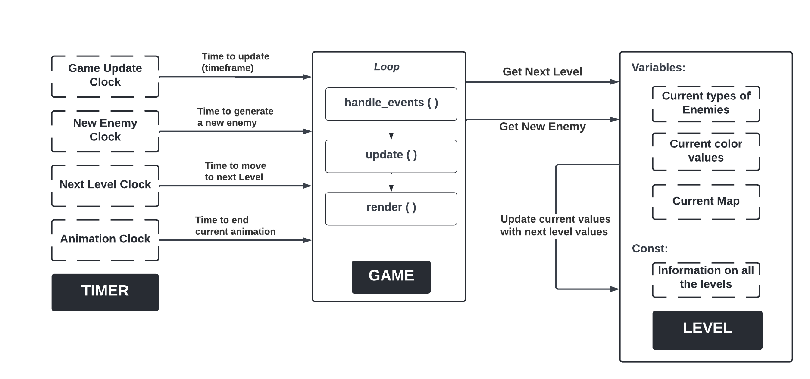

# 
 Remake de TEMPEST ATARI 1981 en C++ Moderne

## 
 UE Programmation Avancée - Rapport Individuel 

### 
 **FOERSTER Stephen** <<stephen.foerster@etu.unistra.fr>> 

#### 
 Binôme: JANATI Siham <<siham.janati@etu.unistra.fr>> 

#

## **Introduction**

Le sujet de ce projet est la réalisation d'un remake du jeu d'arcade Tempest Atari (version 1981) avec la libraire SDL, le but principal étant la prise en main du C++ moderne et plus généralement de la programmation orientée objet.
Ce rapport présente le modèle de développement, la spécification, nos choix d'implémentations, les difficultés rencontrées et finalement nos perspectives.

Nous avons opté pour un modèle de developpement agile pour ce projet. Nous avons commencé par étudier les fonctionnalités du jeu et définir une spécification complète sans nous fixer une limite vis à vis de nos objectifs. Cela nous a permis d'avoir une vision loitaine dès le départ, notre code pouvait donc à toute étape du projet être facilement incrémenté pour intégrer plus de fonctionnalités.

## **Spécification**

### **Diagramme UML**

 

### **Choix d'implémentation**

**Fonctionnement générale du programme principal**

 

Le programme principale tourne en boucle et vérifie à chaque itération l'état du jeu, qui lui est mis à jour au sein des fonctions *handle_events()*. Les classe Menu, Pause et GameOver instancie un pointeur vers Game afin de récupérer certaines informations sur l'état actuel de la partie. 

**Intéractions entre les 3 classes: Game, Timer et Level**

Afin de respecter les prérequis de notre processus incrémentale, nous avons créer des entités séparées pour chaque fonctionnalité. Ainsi, la classe ***Game*** qui s'occupe de mettre à jour l'état du jeu et du rendu est séparée de la classe ***Level*** qui elle contient toutes les informations nécessaires qui caractèrisent chaque niveau en particuler et qui se met à jour au signal de la classe ***Game*** pour passer au niveau suivant, construire la nouvelle carte et mettre à jour le types des ennemis ainsi que leurs couleurs.  

La classe ***Level*** contient une instantation complète de toutes les fonctionnalités du jeu.
Pour les intégrer, il suffirait de créer les classes manquantes, et décommentez une ligne du code dans ***Level***. Par exemple pour ajouter une nouvelle carte, il n'y a pas de modifications à apporter à d'autres classes, il suffit de créer la classe pour cette carte, et décommenter une ligne dans ***Level***. Elle fera ainsi partie du jeu. Similairement pour les ennemis. 

La gestion du temps est gérée par la classe ***Timer***, qui est une ensapsulation de SDL et qui permet d'instancier une horloge, de la mettre à jour, de la mettre en pause ou de récupérer sa valeur. La classe contient un vecteur d'horloges. Pour l'utiliser dans ***Game***, un ***enum*** défini dans le fichier ***Utils.hpp*** permet de récupérer l'index de l'horloge qui nous intéresse.  

**Affichage des scores et informations sur la partie**
 

L'affichage du texte est gérée par la classe ***TextRenderer*** avec les fontes de Hershey, cette classe permet aussi de créer d'autres rendus comme les points de vie qui sont représentées par des images d'un vaisseau, comme dans le jeu original. 
Nous avons aussi ajouté la possibilité d'agrandir le texte, de l'afficher en plus gras, ou de le centrer.
 

**Encapsulation de la libraire SDL**
 

Le ***SDLWrapper*** est une encapsulation de la libraire SDL, c'est un fichier contenant des méthodes dont toutes les classes ont accès, ce n'est pas une classe. 
Pour pouvoir utiliser les fonctionnalités du C++ moderne, les smart pointers notamment, il nous a fallu définir une encapsulation des pointeurs classiques des objets de la SDL. Pour cela, nous avons créer une fonction Template qui prends en paramètre un pointeur classique, et retourne un smart pointer. Au sein de cette fonction, une fonction lambda, utilisée comme paramètre à la création du smart pointer, permet de définir une fonction de libération du pointeur classique car cette dernière est requis par les smart pointers. 
Ce fichier peut être utilisé par toutes les classes et contient aussi une encapsulation des méthodes d'initialisation de la libraire, de rendu d'images, de changement de couleur. Nous avons trouvé plus élégant de ne pas y intégrer la gestion du temps et de l'audio, mais plutôt les mettre dans deux classes séparés: la classe ***Timer*** qui elle joue le rôle d'un chronomètre gérant plusieurs horloges à la fois, et la classe ***Audio*** qui joue le rôle d'un lecteur wav, le fonctionnement de cette dernière sera détaillée plus bas. Ces deux classes constituent aussi une encapsulation de SDL. 

  

## Respect des consignes du Projet: C++ Moderne

 

Nous avons le plus possible essayé d'intégrer les avantages du C++ moderne. Nous utilisons exclusivement des smart pointers, les pointeurs classiques de SDL sont encapsulés.
Les passages par référence et const sont aussi utilisé autant que possible, et les références sur rvalue sont aussi très souvent utilisés dans notre projet notamment dans les constructeurs vu que nous créons souvent des variables qui servent uniquement à construire une instance de classe, par exemple pour créér un ennemi dans un Tunel en particulier.
Nous utilison également exclusivement les containers de la STL, souvent des itérateurs pour les boucles, ou alors des *for range* quand il n'y a pas besoin de modifier le container dans la boucle.
L'héritage et le polymorphisme a biensur aussi été indispensable pour ce projet notamment pour les Map et les Ennemis qui héritent d'une classe commune mais ont des comportements différents. Des cast dynamiques permettent quand nécessaire d'appeler des fonctions spécifiques aux classes dérivées. Nous utilisons dans ce cas *dynamic_pointer_cast*, un cast spécialement pour les smart pointers. Les autres cast sont tous aussi effectués avec *dynamic_cast* ou *static_cast*. 

 

**Audio et Threading**
 

La gestion des effets sonores a necessité l'introduction des threads, nous avons saisi l'occasion pour intégrer plus de fonctionnalités du C++. Cependant, la libraire SDL ne permet pas une gestion faciles de ces effets, et des erreurs de segmentations arrivent parfois quand plusieurs device sont ouverts. En local, quand les device sont limités à 5 voire 6, il n'y a pas de problèmes, nous avons donc préféré désactivé le son par précaution. Ce dernier peut être activé facilement en mettant la variable globale SOUND à 1. Celle-ci est en haut du fichier main.cpp.

## Répartition des tâches

Nous avons commencé ce projet assez tôt durant le semestre, et nous nous sommes arrangés pour avoir des réunions régulières sur l'avancée du projet. Nous avons tous les deux travaillé sur à peu près toute les types de fonctionnalités du jeu très souvent en communiquant au moment de programmer et en s'entraidant.
En ce qui concerne ma partie, je me suis surtout focalisé sur les ennemies, les menus (menu principal, menu pause, menu game over), les transitions de changements de niveaux, les missiles et les classes pour les dessins géométriques.
Pour ce qui est des transitions de changements de niveaux, nous avons remarqués de légers problèmes dans le jeu suite à ces modifications, nous avons donc décider de laisser ces animations sur une branche à part car nous n'avions pas le temps de les corriger avant le rendu final. Si vous voulez observer ces animations je vous invite à lancer le jeu depuis la branche "64-styliser-le-passage-au-niveau-suivant" le dernier commit étant le commit n°: 73b56b8e.
Nous avons utilisé des issues Gitlab pour faciliter la gestion des tâches, ainsi que des outils de travail collaboratif comme Miro et Lucid Chart pour la spécification. 

 

## **Difficultés rencontrées**

**Mouvement des ennemis**

Au départ, nous avons eu des difficultés avec le déplacement des ennemis et la formule d'homotéthie. Notamment pour les spikers qui avancent puis font marche arrière, ou la rotation des Flippers entre les couloirs. Nous avons finalement réussis les Spikers mais les rotations des Flippers n'étaient pas bien géré donc nous avons décidé d'annuler cette partie, les Flippers changent actuellement de couloir sans faire de rotation.

Pour moduler la vitesse, nous avons apporté des modifications à la formule d'homothétie. Le facteur n'est plus proportionnel à z² mais à une racine d'ordre n de z puissance m. C'est la classe niveau qui calcul le facteur d'homothétie selon le niveau actuel, ainsi dans un niveau élevé le facteur h grandit plus rapidement d'un timeframe à l'autre. 

**Latence**
 

Il nous arrive parfois d'avoir un problème de latence bien que peu détectable, nous avons remarqué qu'il est possible de paralléliser le rendu, par contraire de temps nous n'avons pas pu ajouter cette partie.

 

## **Fonctionnalités actuelles et perspectives**

Notre version actuelle intègre la majorité des fonctionnalités du jeu du point de vue Game Logic. Tous les ennemis sont intégrés. Il reste du travail sur quelques animations notamment les Flippers et leurs rotation.
Certains ennemis n'apparaissent qu'à un certain niveau, ainsi pour voir le fonctionnement des Spikers, il faut commencer au niveau 4, pour les Fuseballs c'est le niveau 11, les FuseballTankers au niveau 33, et les PulsarTankers au niveau 41.  
Nous avons intégré 3 Maps (Cercle, Carré et Triangle). Tous les niveaux sont aussi intégrés, il est possible d'effectuer le choix de niveau au menu de démarrage. Comme dans le jeu original, le démarrage au niveau X permet de commencer avec un score Y. La map invisible est aussi présente à partie du niveau 65 jusqu'au niveau 80. 
Le SuperZapper est aussi implémenté. Le joueur dispose de 2 SuperZappers par niveau, le premier permet de tuer tous les ennemis, le 2ème tue un ennemi aléatoirement. 
Nous avons en perspective d'intégrer toutes les Map du jeu, ajouter un mode multijouer, améliorer les Menus, paralléliser le rendu, compléter les actions des ennemis, et optimiser notre code en utilisant plus les possibilités du C++ moderne. 